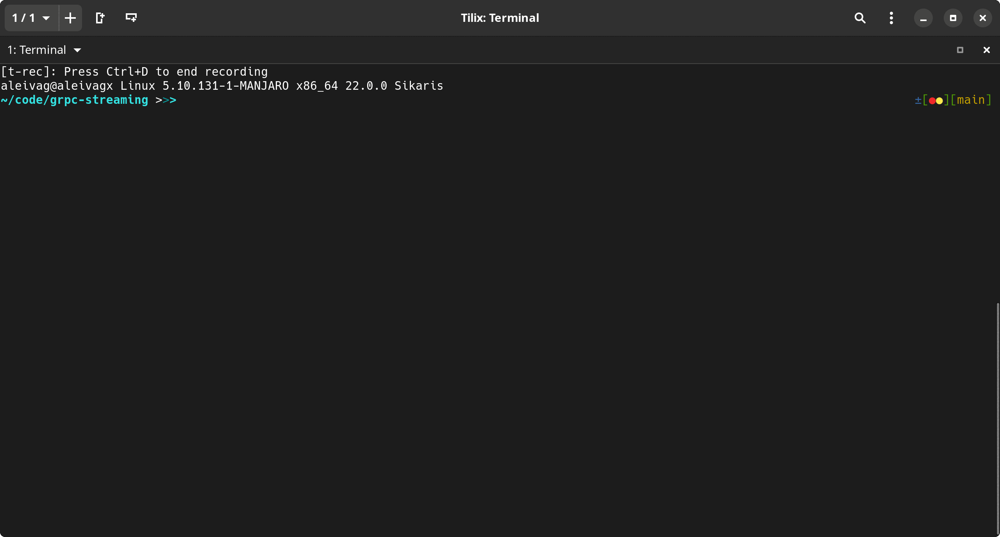
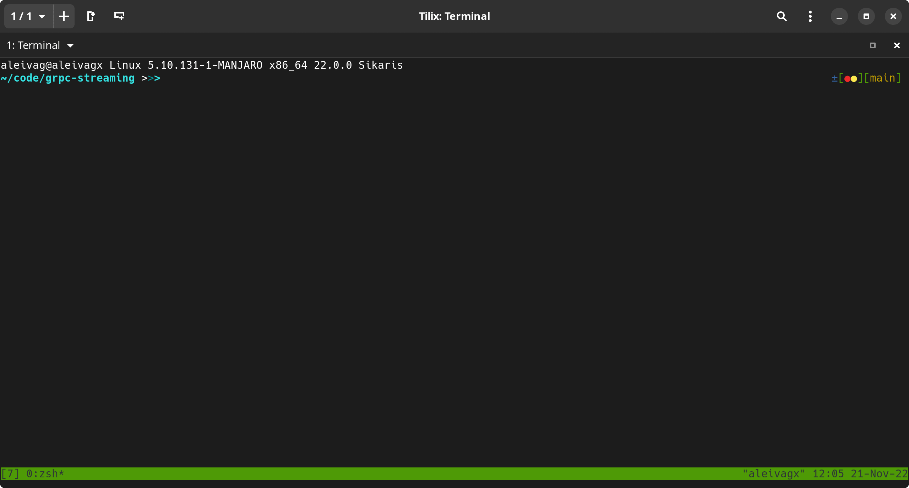

Bidirectional streaming in gRPC
------------------------------

What this is testing its the bidirectional streaming capabilities of gRPC. what you use it

What is it?
===========

We will create a server and client, the idea is that the client will ask the server to start a shell
then will capture the stdin and stdout of the client to send stdin keystrokes and signals to the server
through the streaming request, and will read the streaming response of the server and write to stdout.

On the other hand the server will connect the stdin and stdout of the spawned process to the streaming 
request and response.

making the client terminal look and feel like a remote terminal. 

Demo
====

You can check in the demos, that things like tab competition, signal passing, and full workflow flows back and forward

| DEMO                         |
|------------------------------|
| Regular shell                |
|       |
| Python                       | 
|  |


Usage
=====

Will create a venv 

```bash
[~] ./bootstrap.sh
```

run the server

```
[~] ./.venv/bin/python server.py
```

then the client

```
[~] ./.venv/bin/python client.py
```